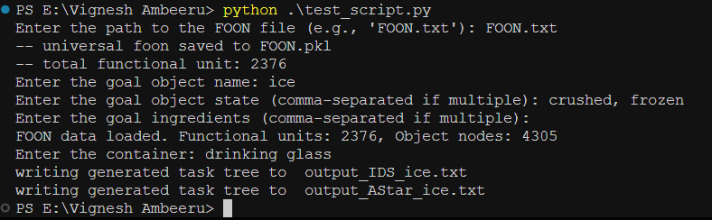

# Project 1: Knowledge Retrieval (part - 2 Implement search algorithm)

## Introduction

This part of project includes implementing Iterative Deepening Search (IDS) and A\* Search algorithms to retrieve a task tree based on the user's goal, and the ability to handle multiple ways to prepare an object efficiently using heuristics and cost functions.

## Features

- Load and process a FOON graph from a text file.
- Specify goal objects (e.g., dishes or foods), their states, ingredients, and containers.
- Performs both Iterative Deepening Search and A\* Search through FOON nodes to find a sequence of steps required to achieve the goal.
- Saves the generated task tree to an output file.

## Usage

To run the program, follow these steps:

1. **Run the main script**:
   ```bash
   python test_script.py
   ```

### Follow the prompts:

1. Enter the path to the FOON file - i.e, `FOON.txt`
2. Enter the goal object’s name - for example: `ice`
3. Enter the goal object’s state(s) (comma-separated if multiple).
4. Enter the ingredients (comma-separated if multiple).
5. Enter the name of the container required for the goal object.

Once the process is completed, the system will search for the goal object and its matching sequence in the FOON graph. It generates an output task tree saved in a `.txt` file containing the recipe steps.

### Output Screenshot:


